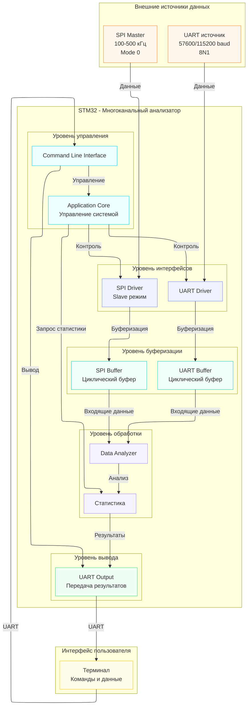

# internship

```mermaid
---
config:
  layout: elk
---
graph TB
    subgraph External["Внешние источники данных"]
        UARTSource["UART источник<br/>57600/115200 baud<br/>8N1"]
        SPISource["SPI Master<br/>100-500 кГц<br/>Mode 0"]
    end
    
    subgraph STM32Device["STM32 - Многоканальный анализатор"]
        subgraph InterfaceLayer["Уровень интерфейсов"]
            UARTDriver["UART Driver"]
            SPIDriver["SPI Driver<br/>Slave режим"]
        end
        
        subgraph BufferLayer["Уровень буферизации"]
            UARTBuffer["UART Buffer<br/>Циклический буфер"]
            SPIBuffer["SPI Buffer<br/>Циклический буфер"]
        end
        
        subgraph ProcessingLayer["Уровень обработки"]
            Analyzer["Data Analyzer"]
            Statistics["Статистика"]
        end
        
        subgraph ControlLayer["Уровень управления"]
            CLI["Command Line Interface"]
            AppCore["Application Core<br/>Управление системой"]
        end
        
        subgraph OutputLayer["Уровень вывода"]
            UARTOutput["UART Output<br/>Передача результатов"]
        end
    end
    
    subgraph UserInterface["Интерфейс пользователя"]
        Terminal["Терминал<br/>Команды и данные"]
    end
    
    UARTSource -->|"Данные"| UARTDriver
    SPISource -->|"Данные"| SPIDriver
    
    UARTDriver -->|"Буферизация"| UARTBuffer
    SPIDriver -->|"Буферизация"| SPIBuffer
    
    UARTBuffer -->|"Входящие данные"| Analyzer
    SPIBuffer -->|"Входящие данные"| Analyzer
    
    Analyzer -->|"Анализ"| Statistics
    
    CLI -->|"Управление"| AppCore
    AppCore -->|"Контроль"| UARTDriver
    AppCore -->|"Контроль"| SPIDriver
    AppCore -->|"Запрос статистики"| Statistics
    
    Statistics -->|"Результаты"| UARTOutput
    CLI -->|"Вывод"| UARTOutput
    
    UARTOutput -->|"UART"| Terminal
    Terminal -->|"UART"| CLI
    
    classDef extSource stroke:#fb923c,fill:#fff7ed
    classDef interface stroke:#818cf8,fill:#eef2ff
    classDef buffer stroke:#2dd4bf,fill:#f0fdfa
    classDef processing stroke:#a78bfa,fill:#f5f3ff
    classDef control stroke:#22d3ee,fill:#ecfeff
    classDef output stroke:#4ade80,fill:#f0fdf4
    classDef user stroke:#facc15,fill:#fefce8
    
    class UARTSource,SPISource extSource
    class UARTDriver,SPIDriver interface
    class UARTBuffer,SPIBuffer buffer
    class Analyzer,Statistics processing
    class CLI,AppCore control
    class UARTOutput output
    class Terminal user
```